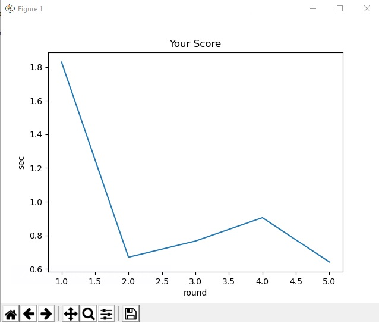

## py_words_game
Program created for learnig python on Udemy.com

# MASTER OF WORDS    
Made by Rayan

#### 1. General info.
#### 2. Technologies.
#### 3. Setup.
#### 4. Status.
#### 5. To Do.
#### 6. Sources.

### General info.

Program created for learn time and plot modules.
It helps me to understand how python works. It's exercise on Udemy.com
Program practise with you typing words on kayboard, showing how long it takes you to write one word 5 times.
In the end it's showing your statistic on chart.

### Technologies.

I used 2 modules:
* Time module.
* Matplotlib module (3.2.1)
* Python (3.8.1)

### Setup.

You need only an IDLE for python and those 2 modules. Time module is installed with python libary.
For istalling Matplotlib on your powershell(for windows) type "pip install matplotlib".
Or visit web site https://matplotlib.org/users/installing.html there is instruction on how to install on all systems.

### Status.

Wrigt now you can type one word and see your resulrs and statistic on chart.
I want to creat libary with lots of words that will be random generated for every new 5 trys.
Create average time displayed in the end of game.
To average time for every letter.
To see every mystake you made.
Add levels that you can pic one and on higher levels will be longer words or even sentence.

### To Do.

For now:
* add more words
* average time for every word and avrage time/letter

### Sources.

This app is inspired by Ivan Lourenço Gomes course "Learn to Code in Python 3: Programming beginner to advanced"
on Udemy: https://www.udemy.com/course/learn-python-programming-a-step-by-step-course-to-beginners/

